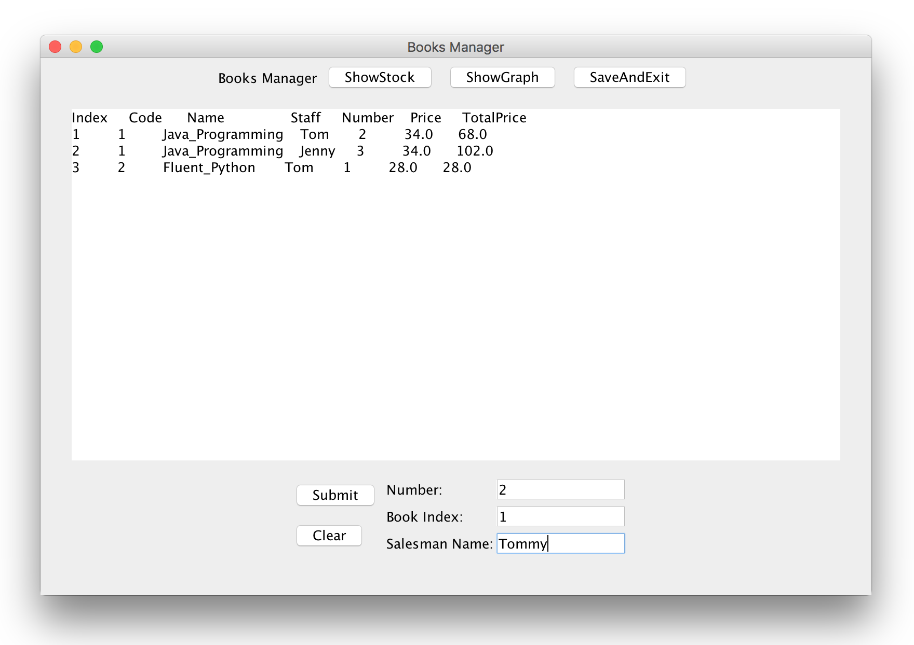
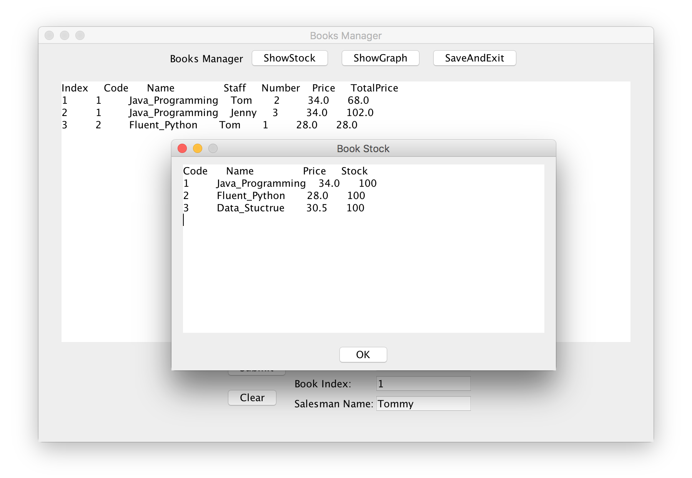
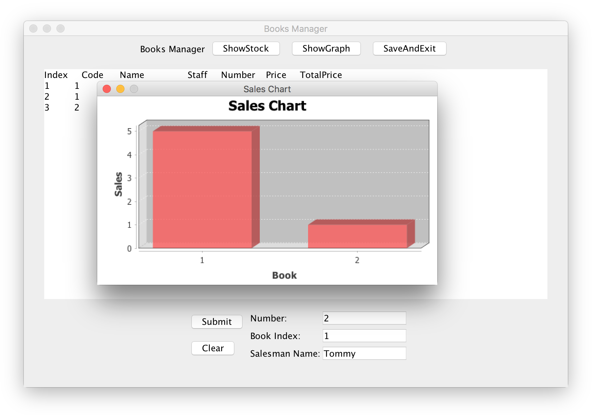

## WHU Java程序设计公选课计结课作业，可供参考#滑稽
> 如果有更新的话可以联系我~

---

# Books Manager-Java Programming Job(WHU)

Programming job of Java Programming in WHU, instructor: Mr Z.Kang

Completed by Tommy(Haotian) Xu in `Fri. 15th,Dec,2017`

## Screen Shots

Develope on `macOS` with `IntelliJ IDEA`.

Main UI shots:

*And some more details not shown here...*

## Project File Tree

- TestProg
	- res
		- Books.txt
		- Sales.txt
	- src
		- com.xht97
			- Main
				- TestProgram.java
			- Model
				- Book.java
				- Sale.java
			- Service
				- BookList.java
				- SaleList.java
				- Fileshelper.java
			- UI
				- Frames
					- BooksSalesFrame.java
					- BookFrame.java
					- ChartFrame.java
				- mJButton.java
				- mJFont.java
	- libs
		- jfreechart-1.0.18.jar
		- jcommon-1.0.23.jar

## Design Model

I use MVC model as following, package `Main` provides the entrance of the whole program, package `Model` provides the basic model `Book` and `Sale`, package `Service` provides the control service when user updates book stock or sales some of the book. package `UI` provides the UI by swing framework.

## Source Code

### Package Main

This package includes one java file `TestProgram.java`

This file includes the entrance of this whole program:

	public class TestProgram{
		public static void main(String[] args){
			...
		}
	}
	
### Package Model

This package includes `Book.java` and `Sale.java`.

Each java file provides a model of a object.

For example:

	public class Book {
   		private int Code;
    	private String Name;
    	private float Price;
    	private int Stock;
		
		...
	}

This shows what proporties should included in a book model.

### Package Service

This package includes three java files: `BookList.java`, `SaleList.java` and `FilesHelper.java`.

The former two files provides a class to manage a book list or a sale list. FilesHelper provides a class to access the txt files where the data stored in.

### Package UI

*Include a sub package `Frames`*

Includes `BookSalesFrame.java`, `BookFrame.java`, `ChartFrame.java`, `mJFont.java` and `mJButton.java`.

Frame java files provides the User's Interface which is shown in the [screen shots](#screen_shots).

mJFont set user's own fonts.

mJButton is not used by the program until now.
